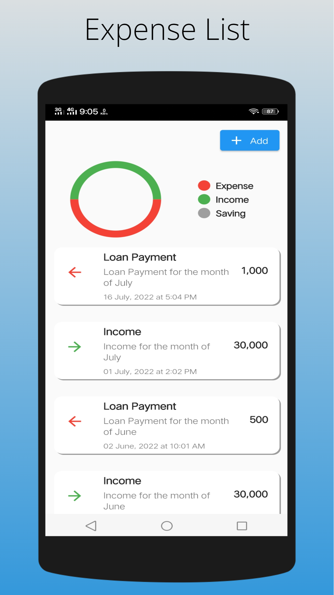
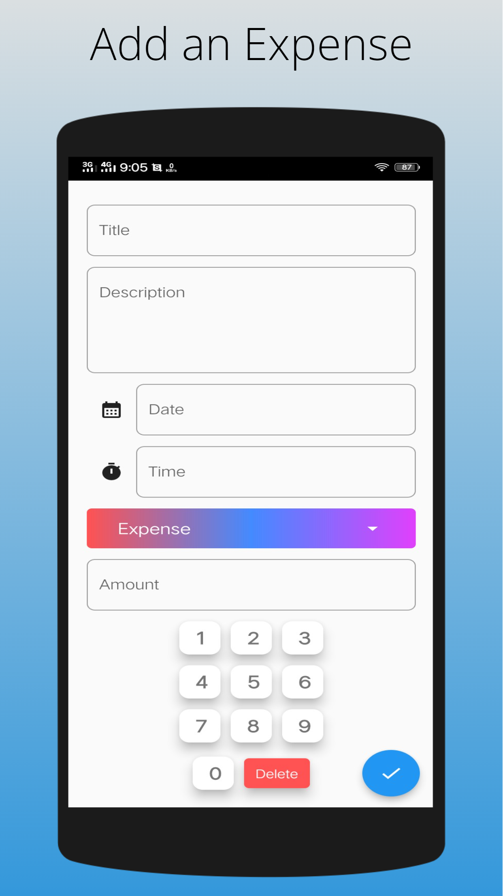

# Expense Tracker

A Expense Tracker App. What Does an Expense Tracker App Do? An expense tracker app allows you to monitor and categorize your expenses across different bank and investment accounts and credit cards. Now Take your expense tracker with you wherever you go.

# Screenshots

## Getting Started

A few resources to get you started if this is your first Flutter project:

- [Lab: Write your first Flutter app](https://flutter.dev/docs/get-started/codelab)
- [Cookbook: Useful Flutter samples](https://flutter.dev/docs/cookbook)

For help getting started with Flutter, view our
[online documentation](https://flutter.dev/docs), which offers tutorials,
samples, guidance on mobile development, and a full API reference.
